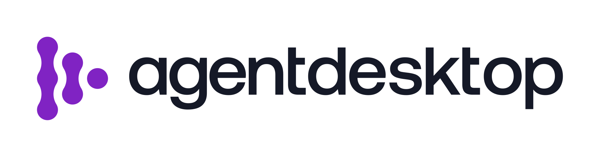

<picture>
  <source media="(prefers-color-scheme: dark)" srcset="./src/app/logo-light.svg">
  
</picture>

[](https://discord.gg/uKX2FvCVpS)

---

This repository contains the [public website](https://agentdesktop.dev), documentation, blog, and deployment resources for [agentdesktop](https://github.com/agentdesktop-dev/agentdesktop).

## About Agentdesktop

Agentdesktop gives platform teams visibility and control over AI developer tools running on employee workstations. It complements MDM with an AI-tool-aware layer that can:

- discover supported tools and versions, then inventory MCP servers, skills, and models without collecting their secrets or contents;
- apply managed configuration and shared sandbox policy through each tool's native settings;
- connect tools to an LLM gateway with short-lived credentials carrying user, device, and allowed client context.

Agentdesktop supports standalone use on one workstation and controller-managed fleets. Current integrations cover Claude Code, Claude Desktop, Codex, OpenCode, and VS Code across Linux, macOS, and Windows, with capabilities varying by tool and operating system. See the [project README](https://github.com/agentdesktop-dev/agentdesktop#supported-tools) for the current support matrix and architecture.

## Repository layout

| Path | Contents |
| --- | --- |
| `src/app/` | Next.js marketing site served at `/` |
| `docs/` | Hugo documentation served at `/docs/` |
| `blog/` | Hugo blog served at `/blog/` |
| `deploy/` | Agentdesktop production deployment and local smoke-test assets |
| `scripts/` | Blog image and downloadable deployment-kit generators |
| `public/` | Shared static images, videos, downloads, redirects, and headers |

## Local development

Install Node.js, npm, and [Hugo Extended](https://gohugo.io/installation/), then install the locked dependencies:

```bash
npm ci
```

Run the marketing, documentation, and blog servers in separate terminals:

```bash
npm run dev       # http://localhost:3000
npm run dev:docs  # http://localhost:1313/docs/
npm run dev:blog  # http://localhost:1314/blog/
```

Next.js proxies `/docs/*` and `/blog/*` to their Hugo servers during local development, so the combined site is available at [http://localhost:3000](http://localhost:3000).

## Writing blog posts

Create a draft blog post with:

```bash
npm run new:post -- posts/my-post.md
```

Posts live in `blog/content/posts/`. Set `draft: false` when a post is ready to publish. Use categories for broad sections and tags for specific topics; both generate archive pages and RSS feeds.

The newest published post in the `Announcement` category automatically appears in the banner on the marketing homepage. Drafts and future-dated posts are ignored.

Blog builds generate a branded `1200x630` Open Graph card under `/blog/og/` for every post. Set `ogImage` and `ogImageAlt` in a post's front matter to use a custom social image instead.

## Deployment kit

Development and production builds regenerate the downloadable GCP deployment kit at `public/downloads/agentdesktop-gcp-deployment-kit.zip` from an explicit source-file allowlist. Rebuild only that archive with:

```bash
npm run build:deployment-kit
```

## Validation and contributing

Run the full validation suite before opening a pull request:

```bash
npm run check
```

This runs ESLint, builds the Next.js site, and builds the Hugo documentation and blog. Product code and product-level issues belong in the [agentdesktop project repository](https://github.com/agentdesktop-dev/agentdesktop).

## Agentdesktop production resources

The [production deployment guide](docs/content/operations/production.md) covers Agentdesktop architecture, identity, PKI, controller, MDM, pilot, and operating requirements. GCP Terraform, Helm, image-build, PKI, Intune bootstrap, backup, teardown, and local smoke-test assets are indexed under [deploy/](deploy/README.md). These resources deploy Agentdesktop itself, not this website.
